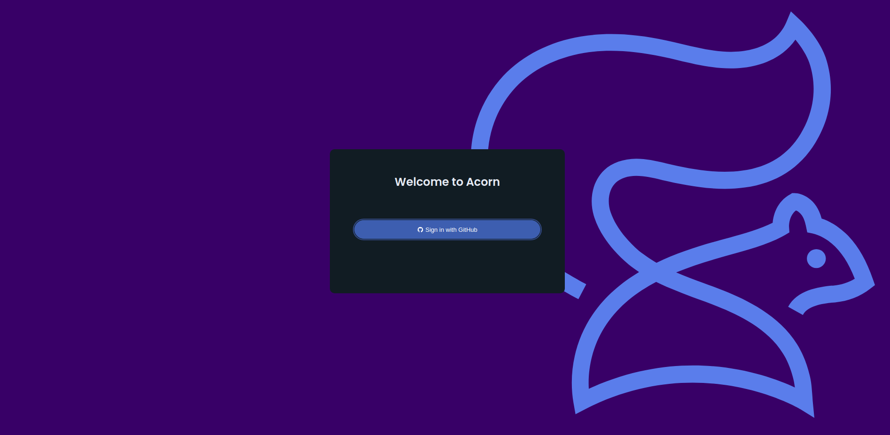
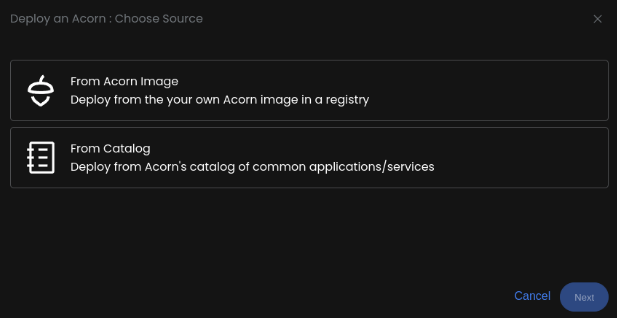
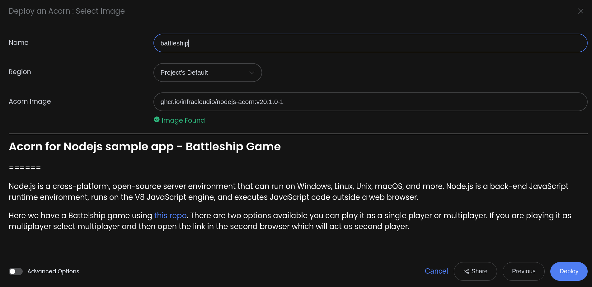
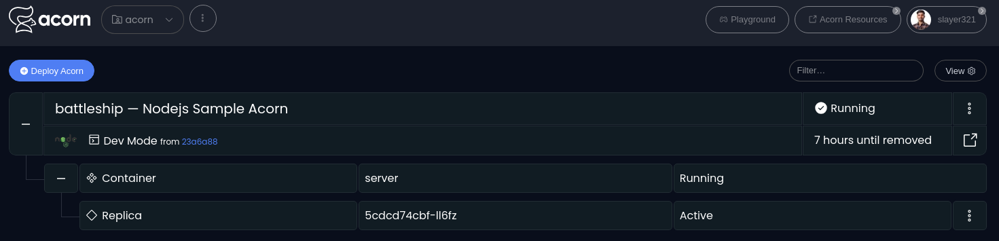
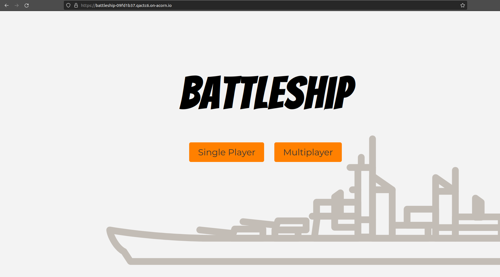
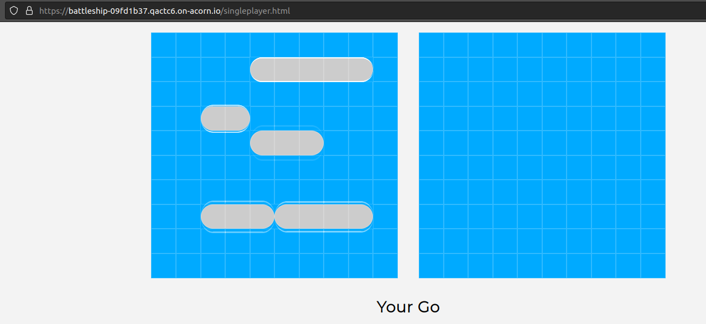
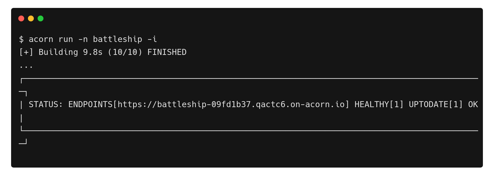

# Deploying Battleship game build using Nodejs on Acorn

[Node.js](https://nodejs.org/en/) is a cross-platform, open-source server environment that can run on Windows, Linux, Unix, macOS, and more. Node.js is a back-end JavaScript runtime environment, runs on the V8 JavaScript engine, and executes JavaScript code outside a web browser.

[Acorn](http://www.acorn.io) offers a user-friendly cloud computing platform with a generous free sandbox accessible through GitHub registration. Designed to simplify the deployment of modern cloud-native apps, Acorn facilitates familiar development and deployment workflows using mainstream container tools. By eliminating the need to handle the provisioning or configuration of underlying cloud resources, Acorn provides the robust capabilities of Kubernetes and Terraform without the associated complexity. In this tutorial, we'll guide you through the process of defining and deploying a sample Node.js Application on the Acorn platform using an Acornfile, ultimately creating an easily deployable Acorn Image.

If you want to skip to the end, just click [Run in Acorn](https://acorn.io/run/ghcr.io/infracloudio/nodejs-acorn:v20.%23.%23-%23?ref=slayer321&name=nodejs) to launch the app immediately in a free sandbox environment. All you need to join is a GitHub ID to create an account.

If you want to follow along, I’ll walk through the steps to deploy Battleship game build using nodejs on Acorn.

_Note: Everything shown in this tutorial can be found in [this repository](https://github.com/infracloudio/nodejs-acorn)_.

## Pre-requisites

- Acorn CLI: The CLI allows you to interact with the Acorn Runtime as well as Acorn to deploy and manage your applications. Refer to the [Installation documentation](https://docs.acorn.io/installation/installing) to install Acorn CLI for your environment.
- A GitHub account is required to sign up and use the Acorn Platform.

## Acorn Login

Log in to the [Acorn Platform](http://beta.acorn.io) using the Github Sign-In option with your Github user.


After the installation of Acorn CLI for your OS, you can login to the Acorn platform.

```
$ acorn login beta.acorn.io
```

## Create the Nodejs Application

In this tutorial we will create a simple Nodejs [Battleship game](<https://en.wikipedia.org/wiki/Battleship_(game)>) app following [this](https://github.com/kubowania/battleships) repo. It is a simple Battleship game that provides two modes you can play the game

- Single Player
- Multiplayer

In the Acorn platform, there are two ways you can try this sample application.

1. Using Acorn platform dashboard.
2. Using CLI

The first way is the easiest one where, in just a few clicks you can deploy the Nodejs Battleship game application on the platform and start using it. However, if you want to customize the application or want to understand how you can run your own Battleship applications using Acorn, use the second option.

## Deploying Using Acorn Dashboard

In this option you use the published Acorn application image to deploy the Battleship application in just a few clicks. It allows you to deploy your applications faster without any additional configurations. Let us see below how you can deploy the vote app to the Acorn platform dashboard.

1. Login to the [Acorn Platform](https://acorn.io/auth/login) using the Github Sign-In option with your Github user.
2. Select the "Deploy Acorn” option.
3. Choose the source for deploying your Acorns

   3.1. Select “From Acorn Image” to deploy the sample Application.

   

   3.2. Provide a name "battleship”, use the default Region and provide the URL for the Acorn image and click Create.

   ```sh
   ghcr.io/infracloudio/nodejs-acorn:v20.#.#-#
   ```



_Note: The App will be deployed in the Acorn Sandbox Environment. As the App is provisioned on AcornPlatform in the sandbox environment it will only be available for 2 hrs and after that it will be shutdown. Upgrade to a pro account to keep it running longer_.

4. Once the Acorn is running, you can access it by clicking the Endpoint or the redirect link.

   4.1. Running Application on Acorn

   

   4.2. Battleship game homepages

   

   4.3. Running Battleship game as a single player

   

## Deploy Using Acorn CLI

As mentioned previously, running the acorn application using CLI lets you understand the Acornfile. With the CLI option, you can customize the sample app to your requirement or use your Acorn knowledge to run your own Battleship Nodejs application.

To run the application using CLI you first need to clone the source code repository on your machine.

```
$ git clone https://github.com/infracloudio/nodejs-acorn.git
```

Once cloned here’s how the directory structure will look.

```
.
├── Acornfile
├── Dockerfile
├── LICENSE
├── nodejs.svg
|........
├── public
│   ├── app.js
|   |.....
│   ├── singleplayer.html
│   └── style.css
├── README.md
├── server.js

```

### Understanding the Acornfile

We have the sample Battleship Nodejs Application ready. Now to run the application we need an Acornfile which describes the whole application without all of the boilerplate of Kubernetes YAML files. The Acorn CLI is used to build, deploy, and operate Acorn on the Acorn cloud platform. It also can work on any Kubernetes cluster running the open source Acorn Runtime.

Below is the Acornfile for deploying the Battleship nodejs app that we created earlier:

```
containers: {
    server: {
        build: {
        context:    "."
        dockerfile: "./Dockerfile"
        }
        dirs: "/usr/src/app": "./"
        ports: publish: "3000:3000/http"
    }
}
```

There is single requirements for running Battleship Nodejs Application

- Application Itself

The above Acornfile has the following elements:

- **Containers**: We define a single container named server and define the following configurations:
  - **build**: details required to build the Nodejs Application
  - **ports**: port number the application is listening on and we are also specifying [publish field](https://docs.acorn.io/reference/acornfile#ports) which will give the url to access the application.
  - **dirs**: here we are giving our code dirs

### Running the Application

We have already logged in using Acorn CLI now you can directly deploy applications on your sandbox on the Acorn platform. Run the following command from the root of the directory.

```
$ acorn run -n battleship -i
```

Below is what the output looks like.



## The Battleship Nodejs Application

As it is a simple Battleship game build using nodejs it provides two modes.

- Singleplayer
- Multiplayer

On the homepage you will see the option to select the mode you want to play with if you select single player your opponent will be the computer and if you select multiplayer you can copy the URL and open it in the second tab which will act as second player.


## Running the app in dev mode

If you are developing your application and don't want to start and stop the application everytime you make the changes you can use the incredibly helpful Acorn Dev Mode. Running in dev mode allows you to do continous development of the application, and have your running instance reflect the changes as soon as you save your changes. Run the following command.

```
$ acorn dev -n battleship .
```

## Push an artifact to a registry

Using the Dev mode you can easily modify the application as per your requirement and once the application is working as expected and is ready to be built and packaged, push it to a registry. You can push it to any OCI registry. We will use Github Container Registry in this example. Once published, you can use the acorn image to deploy it directly in the Acorn platform using the dashboard or CLI, as described previously.

### Log in to the registry

Log in to the registry with the command below and follow the prompts.

```
$ acorn login ghcr.io
```

### Build and push the image

Build and push the image with the below command.

```
$ acorn build --push -t ghcr.io/infracloudio/nodejs-acorn:v20.1.0-1
```

Once the application is built and pushed you can use those images to run your application on Acorn Platform.

## What's Next?

1. The App is provisioned on Acorn Platform and is available for two hours. Upgrade to Pro account for anything you want to keep running longer.
2. After deploying you can edit the Acorn Application or remove it if no longer needed. Click the Edit option to edit your Acorn's Image. Toggle the Advanced Options switch for additional edit options.
3. Remove the Acorn by selecting the Remove option from your Acorn dashboard.

## Conclusion

In this tutorial we show how we can use the Acornfile and get our Nodejs Battleship application up and running and it’s very easy to make changes to the Application file when you are developing it without the need of restarting your application. And If you are looking to run the application directly you can run it on Acorn Platform by providing the image name.
